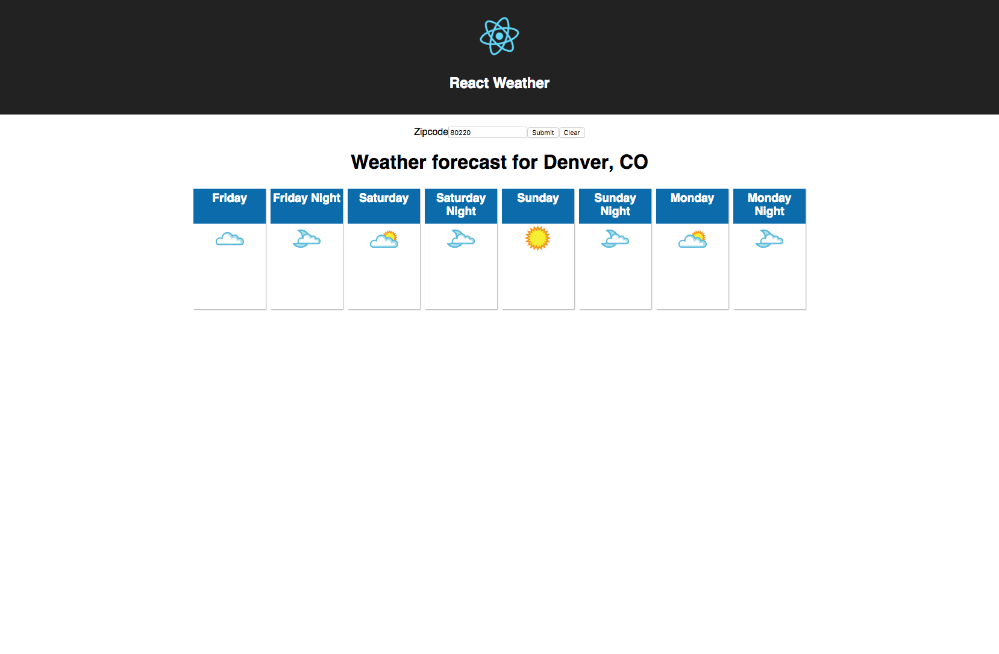

This is a simple project for me to learn about react. I have created 
the same application using Angular 2 and ES6 (No Typescript) and also with vue

https://github.com/jchull/ng2-es6-weather
https://github.com/jchull/vue-weather

**Get an API key**

You must register for a free API key from Weather Underground: https://www.wunderground.com/weather/api

Copy the .env file with name .env.local and change the value of the API key

`npm install`

`npm start`

